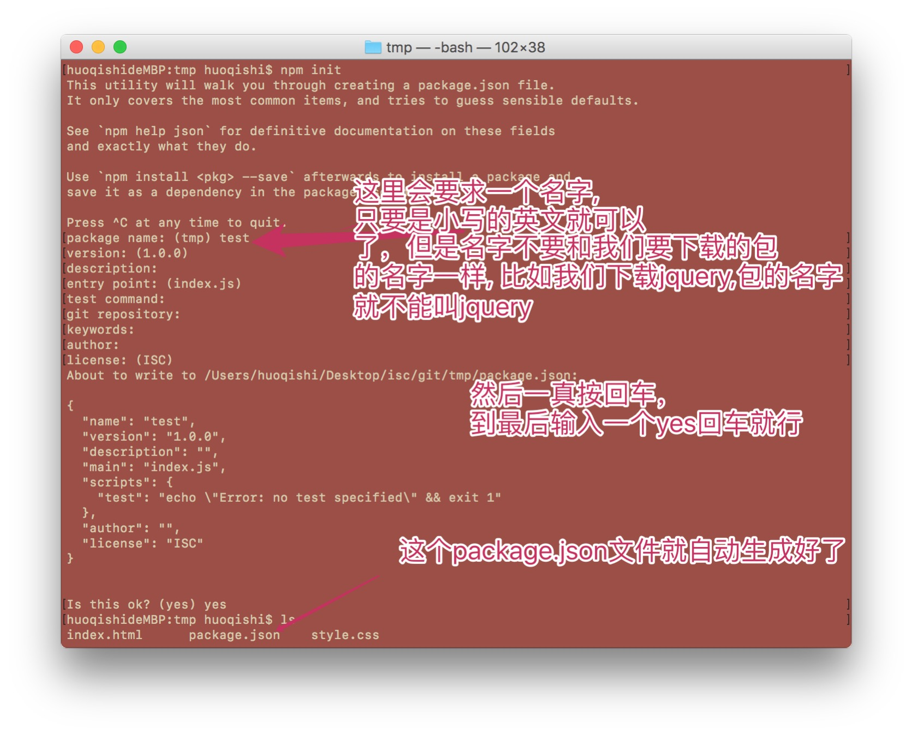
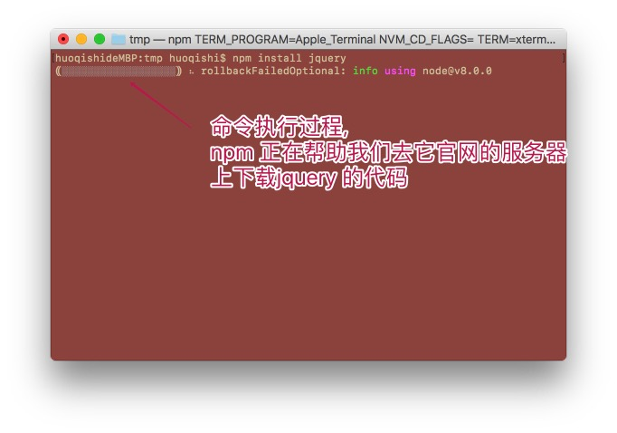
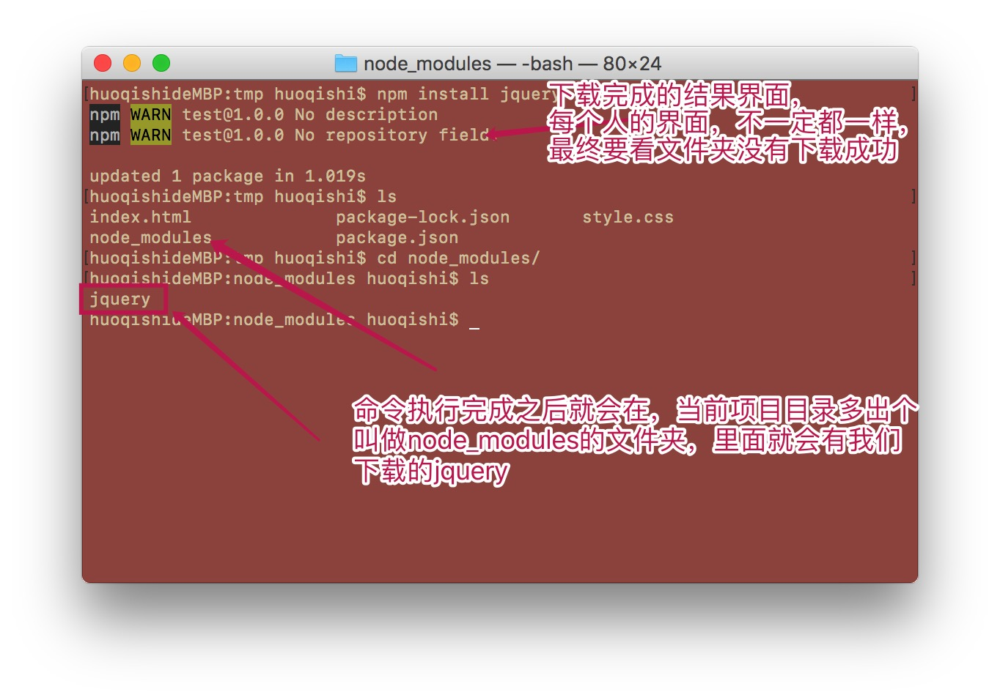

# npm
> 全称 node package manager (node 包管理器)  
> node就是一个类似于浏览器也能够解析并执行js代码的软件(*并不只有浏览器才能执行js代码*)(*就好比说，sublime能编辑js代码，但是并不是只有sublime才能编辑js代码一样*)
> 通俗的讲，npm 其实就是一个能够帮助我们下载各种，我们要使用的前端包的工具, 这里的包指的就是(jquery,bootstrpa,vue,react)这类东西。

## 在电脑上安装 npm 
> 其实我们并不需要单独安装npm ,直接在电脑上安装node就可以了,因为node自带了npm。

## 验证npm是否安装成功
> 在安装完node之后，把所有的`命令窗口都关闭`。打开一个新的cmd窗口，然后输入: `node -v` 回车 或者 `npm -v` 回车。  
> 如果回车后能够看到版本号就表明安装成功!（*由于,每个人安装的node版本不一定都一样，所以看到的版本号不一致是正常的*）

## npm 的基本使用步骤
1. 像往往常一个,写项目要有个项目文件夹,所以我们新建一个项目文件夹(*新建在哪里都可以，就是一个很普通的文件夹*)
2. 打开cmd,cd 到1中新建的文件夹中
3. 在1中新建的文件夹中，创建一个名为package.json的文件。如何创建呢?我们这里通过命令来新建。(*这个文件我们暂里用不到,但是必需要大有,它其实是用来描述项目的相关信息的*)
  + 在cmd中输入命令: `npm init` 回车
  + 如图:   
  

4. 准备使用npm来下载我们所想要的包, 我这里就假设我们下载 jquery 和 bootstrap  
  + 在cmd中输入命令: `npm install jquery` 回车
  + 在cmd中输入命令: `npm install bootstrap` 回车
  + 如图:  
  
  
  上图是安装jquery的截图, 安装bootstrap也是类似的 

*注意*
*虽然，项目文件夹/node_modules/jquery 中会有很多文件夹，其中dist文件夹中就有我们要使用的jquery.js,像往常一样在html中引入它就可以了*
*我们看到的其他的文件夹，其实是jquery的源码,因为有些人，可能会需要使用这个源码，所以就被一起下载下来了*  
> 强制多了一个源码这些文件，其实仔细想想并没有什么太大的坏处。

***

## 扩展知识点
### 什么叫做安装软件